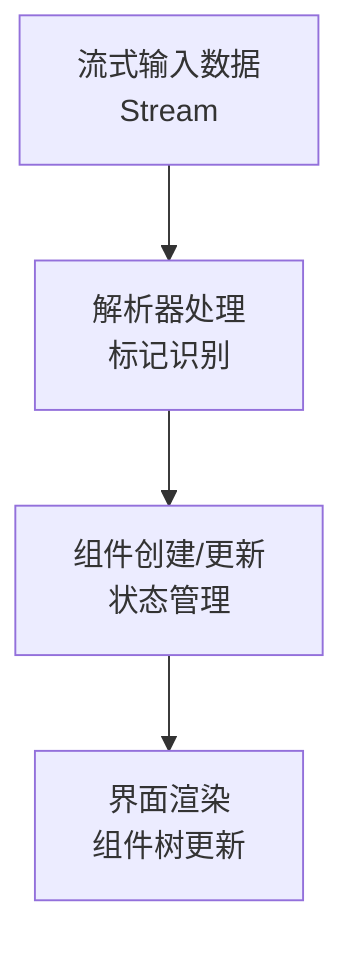

# 流式Markdown渲染系统设计文档

> 注意：此文档已分解为多个子文档以便于维护。请参考以下链接获取详细信息：
>
> - [概述](./STREAM_MD_PLAN_OVERVIEW.md) - 项目背景和整体架构
> - [组件设计](./STREAM_MD_PLAN_COMPONENTS.md) - 组件设计与分类 
> - [详细架构](./STREAM_MD_PLAN_ARCHITECTURE.md) - 详细架构设计
> - [实现计划](./STREAM_MD_PLAN_IMPLEMENTATION.md) - 实现与算法
> - [项目结构](./STREAM_MD_PLAN_PROJECT_STRUCTURE.md) - 文件结构与组织
> - [项目进度](./STREAM_MD_PLAN_PROGRESS.md) - 进度跟踪
>
> 以下内容仅保留为参考，新的开发应参考上述子文档。

## 1. 项目概述

### 1.1 背景
当前应用中的Markdown渲染模块无法支持流式输入处理，导致在与AI对话等场景中，无法实时渲染AI正在生成的内容。需要开发一套全新的流式Markdown渲染系统，以支持流式文本输入的实时解析与渲染。

### 1.2 核心需求
1. **流式输入处理**：支持逐字符/分片接收文本并实时解析
2. **Markdown元素实时渲染**：文本输入时，各类元素能够动态渲染，支持元素的状态变化
3. **支持LaTeX数学公式**：同时支持行内和块级LaTeX公式渲染
4. **高性能渲染**：优化渲染性能，减少重绘范围，支持大文档平滑渲染
5. **组件复用**：最大化复用现有组件和逻辑
6. **健壮性**：处理不完整、错误或特殊格式的输入，保证应用稳定性

### 1.3 关键技术挑战
1. 如何处理分片输入中的不完整Markdown元素
2. 如何平衡实时解析性能与渲染质量
3. 解析状态管理与元素树的动态更新
4. 嵌套结构（如列表中的代码块）的正确处理
5. 确保不同类型Markdown元素的正确渲染顺序

## 2. 架构设计

### 2.1 整体架构
流式Markdown渲染系统将采用分层架构设计，主要包含以下几个核心层：

1. **展示层**：负责最终渲染Markdown元素到UI
2. **解析层**：处理流式输入，解析各类Markdown标记
3. **状态管理层**：维护解析状态与元素树结构
4. **专项处理层**：处理特殊元素（如LaTeX公式、代码块等）

### 2.2 核心模块

#### 2.2.1 MarkdownTypes
```dart
// 定义Markdown元素类型及标记识别
class MarkdownTypes {
  // 标记类型定义映射
  static const Map<String, MarkdownElementType> markupTypes = {
    '###': MarkdownElementType.heading3,
    '##': MarkdownElementType.heading2,
    '#': MarkdownElementType.heading1,
    '```': MarkdownElementType.codeBlock,
    '---': MarkdownElementType.divider,
    '***': MarkdownElementType.divider,
    '___': MarkdownElementType.divider,
    '>': MarkdownElementType.quote,
    '\\[': MarkdownElementType.blockFormulaStart,
    '\\]': MarkdownElementType.blockFormulaEnd,
    '\\(': MarkdownElementType.inlineFormulaStart,
    '\\)': MarkdownElementType.inlineFormulaEnd,
  };
  
  // 核心方法定义
  static MarkdownElementType? getMarkupType(String text);
  static bool needsEndTag(MarkdownElementType type);
  static String? getEndTag(MarkdownElementType type);
  static bool isListMarker(String text);
  static ListProperties? getListProperties(String text);
}
```

#### 2.2.2 MarkdownContentParser
```dart
// 流式内容解析器
class MarkdownContentParser {
  // 状态管理
  ParsingState _state = ParsingState.text;
  StringBuffer _buffer = StringBuffer();
  ActiveComponent? _activeComponent;
  
  // 核心流处理方法
  Stream<ParsedMarkdownElement> parseStream(Stream<String> input);
  List<ParsedMarkdownElement> parseChunk(String chunk);
  
  // 辅助方法
  void _handleSpecialMarkers(String text);
  void _processBuffer();
  void _updateState(ParsingState newState);
}
```

#### 2.2.3 MarkdownDisplayV2
```dart
// 流式Markdown展示组件
class MarkdownDisplayV2 extends StatefulWidget {
  // 支持Stream或完整文本作为输入
  final dynamic input; // Stream<String>或String类型
  final MarkdownTheme? theme;
  
  @override
  State<MarkdownDisplayV2> createState() => _MarkdownDisplayV2State();
}
```

### 2.3 状态管理

#### 2.3.1 解析状态
```dart
enum ParsingState {
  text,              // 普通文本
  inlineFormula,     // 行内公式
  blockFormula,      // 块级公式
  codeBlock,         // 代码块
  quote,             // 引用
  unorderedList,     // 无序列表
  orderedList,       // 有序列表
  heading1,          // 一级标题
  heading2,          // 二级标题
  heading3,          // 三级标题
  link,              // 链接
  image,             // 图片
}
```

### 2.4 组件分类

#### 2.4.1 文本处理组件
- 处理普通文本并识别内联样式
- 识别并应用加粗(`**text**`)、斜体(`*text*`、`_text_`)、加粗斜体(`***text***`)等样式
- 特性：在组件内部处理样式标记，避免外部状态管理的复杂性

#### 2.4.2 独立渲染组件
- 分隔线(`---`、`***`、`___`)
- 图片(``)
- 特性：渲染后即结束，不需要等待结束标记

#### 2.4.3 容器组件
- 标题(`#`、`##`、`###`)
- 代码块(` ``` `)
- 数学公式块(`\\[`、`\\]`)
- 引用块(`>`)
- 特性：需要持续接收内容直到遇到结束标记

#### 2.4.4 特殊处理组件
- 列表组件：
  - 自动识别列表标记(`-`、`*`、`+`、`1.`等)
  - 处理缩进与嵌套
  - 维护列表项的连续性
  - 支持混合列表（有序+无序）
  - 特性：基于行首标记和缩进级别进行处理

## 3. 项目结构规划

### 3.1 文件结构图
```
lib/
└── markdown/                    # 流式Markdown模块根目录
    ├── index.dart               # 模块入口与导出
    ├── stream_markdown.dart     # 流式Markdown主入口组件
    ├── types/                   # 类型定义
    │   ├── markdown_types.dart  # Markdown类型定义
    │   └── parsing_state.dart   # 解析状态定义
    ├── parsers/                 # 解析器
    │   ├── content_parser.dart  # 主内容解析器
    │   ├── inline_parser.dart   # 内联样式解析器
    │   ├── code_parser.dart     # 代码块解析器
    │   └── latex_parser.dart    # LaTeX公式解析器
    ├── widgets/                 # UI组件
    │   ├── markdown_display.dart # 主显示组件
    │   └── elements/            # 元素渲染组件
    │       ├── text_widget.dart  # 文本渲染组件(处理内联样式)
    │       ├── heading_widget.dart # 标题组件
    │       ├── code_block_widget.dart # 代码块组件
    │       ├── quote_widget.dart # 引用组件
    │       ├── list_widget.dart  # 列表组件
    │       ├── divider_widget.dart # 分隔线组件
    │       ├── image_widget.dart # 图片组件
    │       ├── latex_inline_widget.dart # 行内公式组件
    │       └── latex_block_widget.dart  # 块级公式组件
    ├── data/                    # 测试和示例数据
    │   └── content_array.dart   # Markdown内容示例数据(保留现有文件)
    ├── utils/                   # 工具类
    │   ├── text_splitter.dart   # 文本分割工具
    │   └── style_manager.dart   # 样式管理工具
    └── examples/                # 示例页面
        ├── stream_demo_screen.dart # 流式演示页面
        └── full_demo_screen.dart   # 完整功能演示页面
```

### 3.2 迁移计划

#### 3.2.1 保留并重构的文件
- `markdown_element.dart` → `types/markdown_types.dart`
- `markdown_display.dart` → `widgets/markdown_display.dart`
- `content_array.dart` → 保留在`data/content_array.dart`(包含数学公式和Markdown示例)
- 各元素渲染组件 → 对应的新组件文件

#### 3.2.2 新增文件
- `stream_markdown.dart`：新的流式渲染入口
- `content_parser.dart`：流式内容解析器
- `parsing_state.dart`：解析状态定义
- `text_splitter.dart`：文本分割工具

#### 3.2.3 需删除的文件
- 旧版解析器实现
- 旧版状态管理相关代码

## 4. 实现计划

### 4.1 关键算法实现

#### 4.1.1 流式解析算法
```dart
Stream<ParsedMarkdownElement> parseStream(Stream<String> input) async* {
  await for (final chunk in input) {
    final elements = parseChunk(chunk);
    for (final element in elements) {
      yield element;
    }
  }
  
  // 处理最后可能的不完整内容
  if (_buffer.isNotEmpty) {
    final elements = _processBuffer();
    for (final element in elements) {
      yield element;
    }
  }
}
```

#### 4.1.2 文本分割策略
1. **流式输入分割**：
   - 按特殊标记分割
   - 保持标记完整性
   - 处理转义字符

2. **完整文本分割**：
   - 按行分割
   - 识别行内特殊标记
   - 处理多行元素
   - 生成标记流

### 4.2 核心交互逻辑
- 流式内容接收 → 解析器实时处理 → 更新解析状态 → 渲染对应组件
- 组件状态更新 → 仅更新必要部分 → 优化渲染性能
- 特殊情况处理 → 错误恢复机制 → 保证渲染稳定性

### 4.3 数据处理流程

#### 4.3.1 完整流程图



如果无法渲染mermaid图表，可参考以下流程：

1. **流式输入数据** (Stream<String>)
   ↓
2. **解析器处理** (标记识别)
   ↓
3. **组件创建/更新** (状态管理) 
   ↓
4. **界面渲染** (组件树更新)

#### 4.3.2 详细处理步骤

1. **输入接收**
   - `markdown_display` 作为流数据的接收方，接收 `Stream<String>` 或完整 `String`
   - 将接收到的数据传递给 `content_parser` 进行处理
   - 处理不同输入源(完整文本/流式输入)的适配

2. **解析处理**
   - 解析器维护当前解析状态(`ParsingState`)
   - 检测输入文本中的特殊标记(如`#`、`>`、` ``` `等)
   - 根据当前状态和新输入更新解析状态
   - 生成`ParsedMarkdownElement`流，传递给组件创建层

3. **组件创建与管理**
   - 根据解析结果创建或更新相应类型的组件
   - 组件分为三种类型:
     * **文本处理组件**: 处理普通文本和内联样式(加粗、斜体等)，内部解析样式标记
     * **即时渲染组件**: 如分隔线、图片等，创建后即完成渲染
     * **容器组件**: 如代码块、LaTeX公式、引用等，需要持续接收内容直到遇到结束标记
   - 管理组件状态，处理组件嵌套关系

4. **界面渲染**
   - 维护已创建组件的列表，根据组件状态更新UI
   - 处理组件间的布局关系
   - 仅重绘必要的部分，优化渲染性能
   - 支持滚动位置管理和视图范围控制

#### 4.3.3 特殊场景处理

1. **不完整标记处理**
   - 当接收到不完整标记时，保留在缓冲区等待后续输入
   - 设置超时机制，超时后作为普通文本处理

2. **嵌套结构处理**
   - 使用栈结构管理嵌套组件(如列表中的代码块)
   - 维护父子组件关系，确保正确渲染

3. **错误恢复机制**
   - 处理格式错误的输入，尽可能恢复正常渲染
   - 提供降级渲染策略，确保UI不崩溃

4. **专项组件处理**
   - LaTeX公式: 调用专门的LaTeX解析器处理公式内容
   - 代码块: 根据语言提供语法高亮
   - 列表: 处理层级关系和不同类型列表

### 4.4 示例用法

```dart
// 1. 流式使用方式
MarkdownDisplayV2(
  input: textController.stream,
  theme: MarkdownTheme(),
)

// 2. 完整文本使用方式
MarkdownDisplayV2(
  input: """# 标题
这是**加粗**的文本
```
代码块
```""",
  theme: MarkdownTheme(),
)

// 3. 流式内容发送示例
textController.add("这是");
textController.add("**");
textController.add("加粗");
textController.add("**");
textController.add("的文本");
```

## 5. 测试与验证计划

### 5.1 单元测试
- 解析器逻辑测试
- 状态管理测试
- 各类标记识别测试

### 5.2 组件测试
- 各类元素渲染测试
- 复杂嵌套结构测试
- 特殊情况处理测试

### 5.3 集成测试
- 完整流式渲染测试
- 性能压力测试
- 边界情况测试

## 6. 开发注意事项
1. 状态转换时机控制
2. 缓冲区清理时机
3. 特殊字符转义处理
4. 内存占用控制
5. 渲染性能优化
6. 组件状态管理
7. 处理不完整或错误的标记序列
8. 样式状态堆栈管理
9. 标记优先级处理
10. 嵌套标记处理

## 7. 项目分步实施计划

### 7.1 阶段一：基础结构搭建 ✅
- ✅ 创建 `lib/markdown` 目录结构
- ✅ 按照文件结构规划创建基础文件
- ✅ 创建新的演示页面 `MarkdownStreamScreen`
- ✅ 在 `main.dart` 中替换原有Markdown显示为新创建的组件
- ✅ 编写项目入口文件 `index.dart`

### 7.2 阶段二：基础文本显示功能 ✅
- ✅ 创建基础的 `MarkdownDisplayV2` 组件
- ✅ 将 `data/content_array.dart` 移动到新目录结构
- ✅ 实现基础文本拼接逻辑，将流式输入字符串拼接显示
- ✅ 测试组件能正确接收并显示完整文本（不解析标记）
- ✅ 添加简单的布局和样式

### 7.3 阶段三：标记识别与调试输出 ✅
-✅ 实现基础标记识别功能（不改变UI渲染）
- ✅ 在识别到标记时输出调试信息，如：
  - 遇到 `---` 在文本前加入 "找到分隔符"
  - 遇到 ``` 加入 "找到代码块起始/结束"
  - 遇到 `#` 加入 "找到标题标记"
- ✅ 识别LaTeX公式标记如 `\\[`, `\\]`, `\\(`, `\\)`
- ✅ 实现基础状态管理，跟踪当前解析状态

### 7.4 阶段四：UI组件替换 [ ]
- [ ] 逐步将识别到的标记替换为对应UI组件：
  - [ ] 实现普通文本组件（含内联样式处理）
  - [ ] 实现标题组件（一级、二级、三级）
  - [ ] 实现代码块组件
  - [ ] 实现分隔线组件
  - [ ] 实现引用块组件
  - [ ] 实现LaTeX公式组件
  - [ ] 实现列表组件
- [ ] 保持纯文本状态与UI组件的一致性
- [ ] 图片组件留作后续实现

### 7.5 阶段五：完整文本处理优化 [ ]
- [ ] 优化处理完整或较长Markdown文本的逻辑
- [ ] 实现按行分割文本算法
- [ ] 在文本中查找并提取Markdown标记
- [ ] 根据标记将文本切割成数组
- [ ] 优化解析器处理大块文本的性能

### 7.6 阶段六：测试与完善 [ ]
- [ ] 全面测试各类Markdown标记的处理
- [ ] 查找并修复漏处理的Markdown标记
- [ ] 检查并修复解析和渲染中的bug
- [ ] 处理边界条件和错误输入
- [ ] 优化渲染性能
- [ ] 完善文档和示例